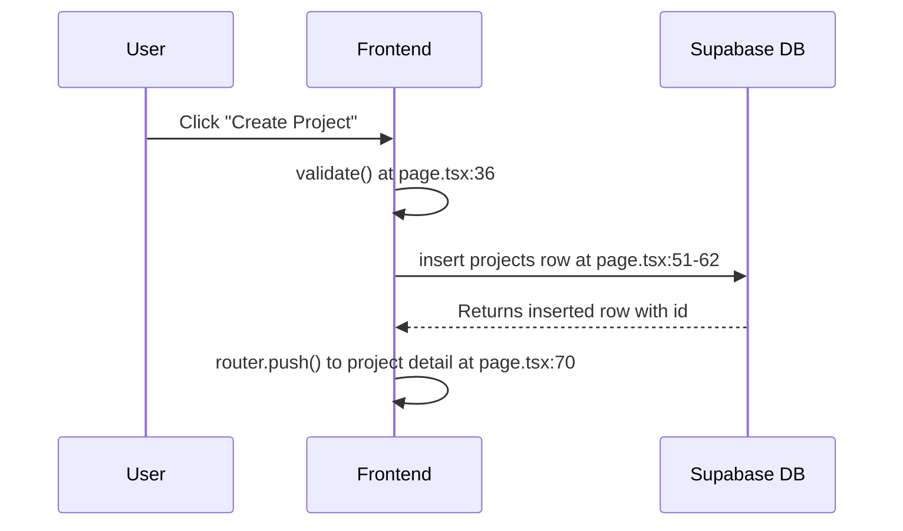
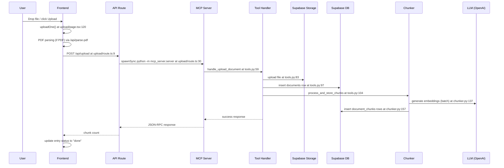
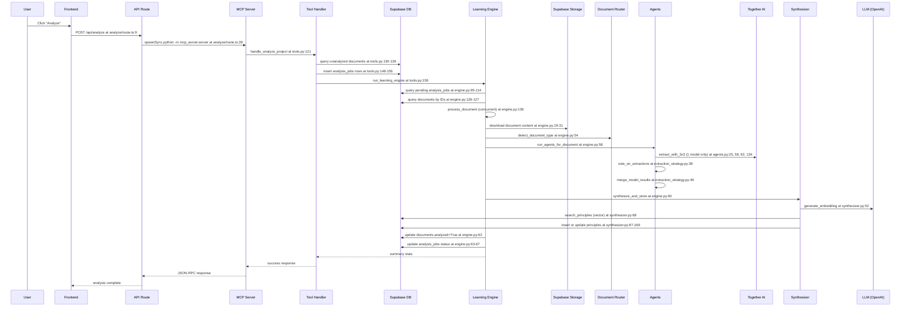
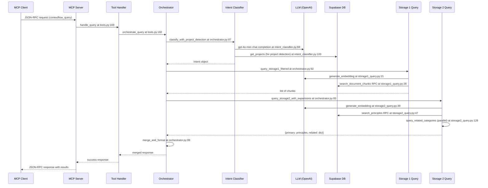
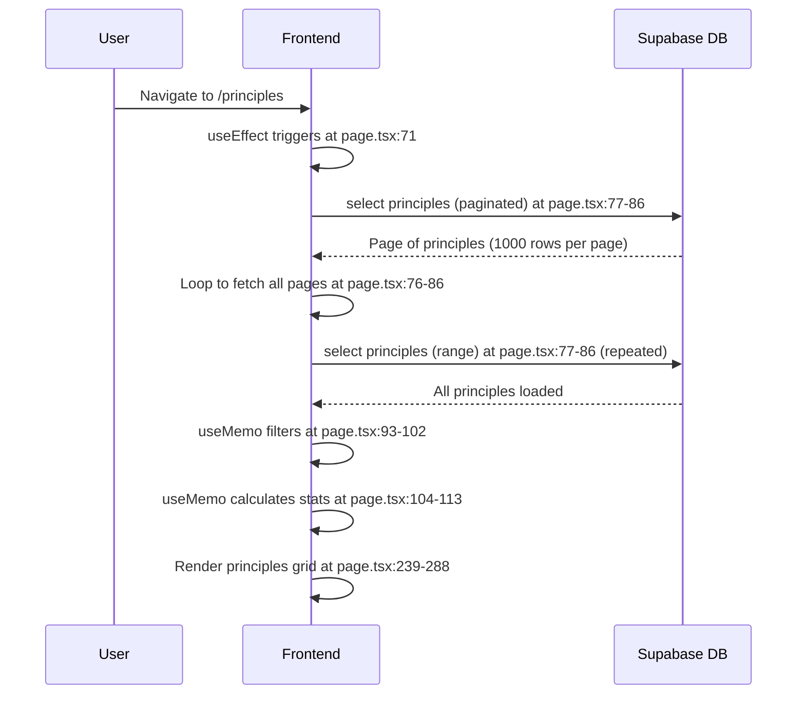

# ContextFlow Critical Path Traces

**Date**: 2025-01-XX  
**Auditor**: Cascade (SWE-1.6)  
**Scope**: Runtime path analysis of 5 critical user flows  
**Repository**: `/Users/sssd/Documents/ContextFlow`  
**Git Root**: `/Users/sssd/Documents/ContextFlow`

---

## Phase 0 — INGEST AUDIT CONTEXT

**Audit Context Read**: `docs/audit/AUDIT_REPORT.md` (27 findings, 3 critical, 2 high, 11 medium, 11 low, 8 unverified)

**Action Plan Status**: `docs/audit/CLAUDE_CODE_ACTION_PLAN.md` does NOT exist.

**Specs Status**: `docs/specs/` directory does NOT exist.

**Prior Notes from Audit**:
- RLS policies hardcoded to `MVP_USER_ID = '123e4567-e89b-12d3-a456-426614174000'` (F4, F58)
- Frontend API routes use `spawnSync` with hardcoded paths to invoke Python MCP server (F18, F39)
- 3x3 extraction strategy exists but only uses one model (Llama-3.3) (audit finding in extraction_strategy.py:24)
- No retry/backoff logic for LLM API calls (F31)
- No authentication/JWT validation (F58)

**Trace Ground Truth**: This analysis traces the actual code execution, not missing documentation. Any gaps between claimed behavior (from audit) and actual code will be noted in F.10 sections.

---

## Path A — Project Creation

### A.1 — Trigger
User clicks "Create Project" button on the frontend new project form at `/projects/new` after filling in name, type, description, and optional tech stack.

### A.2 — Entry point
**Primary entry**: `frontend/app/projects/new/page.tsx:44` (handleSubmit function)  
**Secondary entry (MCP)**: `backend/mcp_server/tools.py:28` (handle_create_project)  
**Trace focus**: Frontend entry (user-visible flow)

### A.3 — Sequence diagram

### A.4 — Step-by-step trace

**Step 1:** Form validation checks required fields
- **At**: `frontend/app/projects/new/page.tsx:36-42`
- **Inputs**: `formData` object with name, project_type, description, tech_stack
- **Outputs**: Boolean (true if valid), sets `errors` state if invalid
- **Async?**: No
- **Can fail**: Validation fails if name is empty or project_type is not selected

**Step 2**: Supabase client inserts project row
- **At**: `frontend/app/projects/new/page.tsx:51-62`
- **Inputs**: `{user_id: MVP_USER_ID, name, description, project_type, tech_stack, status: 'active'}`
- **Outputs**: Supabase response with `{data, error}`. If success, `data` contains the inserted row with generated `id`
- **Async?**: Yes
- **Can fail**: Network timeout, RLS policy violation (if user_id doesn't match MVP_USER_ID), DB constraint violation (name uniqueness not enforced but could fail)

**Step 3**: Error check and user feedback
- **At**: `frontend/app/projects/new/page.tsx:64-68`
- **Inputs**: Supabase response `error` field
- **Outputs**: Sets `submitError` state if error exists, resets loading state
- **Async?**: No
- **Can fail**: None (this is error handling)

**Step 4**: Router navigation to project detail
- **At**: `frontend/app/projects/new/page.tsx:70`
- **Inputs**: `data.id` from Supabase response
- **Outputs**: Navigation to `/projects/${data.id}`
- **Async?**: No
- **Can fail**: Router navigation failure (rare)

### A.5 — State mutations

- `projects` table: One row inserted with columns `{id (UUID), user_id (MVP_USER_ID), name, description, project_type, tech_stack, status, created_at}`
- In-memory: Frontend `formData` state unchanged, `loading` state reset to false, router state updated

### A.6 — The critical line

`frontend/app/projects/new/page.tsx:54` — `user_id: MVP_USER_ID`

**Justification**: This hardcoded user ID is the trust boundary. If this line were changed or broken, the RLS policy would reject the insert (or worse, insert under the wrong user ID, creating data leakage). The entire multi-tenancy claim of the system hinges on this single constant being correct everywhere.

### A.7 — Failure mode catalog

| Failing step | Failure type | What user sees | What logs show | Recovery |
|---|---|---|---|---|
| Step 2 | RLS policy violation | "Row level security policy violation" error in red banner | Supabase error in browser console | Manual: Fix user_id to match MVP_USER_ID |
| Step 2 | Network timeout | Spinner spins indefinitely, then "Network error" | Timeout error in browser console | Retry (user must click again) |
| Step 2 | DB constraint violation | Database error message in red banner | Postgres constraint error in logs | Manual: Fix conflicting data |
| Step 1 | Validation failure | Red error text under required fields | No logs (client-side) | User fills in required fields |

### A.8 — Observability score

- **Traceability**: 2/5 — No structured logs on frontend. Supabase has query logs but not correlated to user action.
- **Failure attribution**: 3/5 — Error messages surface to user, but no request ID to trace in backend logs.
- **Performance attribution**: 1/5 — No timing logged anywhere.

**To raise this flow to 5/5/5, add**: A request ID generated on form submit, logged at each step (validation start, DB insert start/complete, navigation), with timing in milliseconds.

### A.9 — Performance budget

| Step | Latency bucket |
|------|----------------|
| Step 1 (validation) | <10ms |
| Step 2 (Supabase insert) | 10-100ms |
| Step 3 (error check) | <10ms |
| Step 4 (navigation) | <10ms |
| **Total** | **30-120ms** (acceptable) |

### A.10 — Spec-vs-reality delta

No specs exist to compare against. Audit noted missing architecture docs.

---

## Path B — Document Upload + Chunking

### B.1 — Trigger
User drags and drops a file (PDF, MD, or TXT) onto the upload page at `/projects/[id]/upload`, or clicks "Upload" after selecting files.

### B.2 — Entry point
**Primary entry**: `frontend/app/projects/[id]/upload/page.tsx:157` (handleUploadAll function)  
**Secondary entry (MCP)**: `backend/mcp_server/tools.py:59` (handle_upload_document)  
**Trace focus**: Frontend → API route → MCP tool → backend pipeline

### B.3 — Sequence diagram

### B.4 — Step-by-step trace

**Step 1**: Frontend validates file and reads content
- **At**: `frontend/app/projects/[id]/upload/page.tsx:120-155` (uploadOne function)
- **Inputs**: `entry` object with `{file, category, status}`, file is File object
- **Outputs**: File content as string (text) or parsed PDF text
- **Async?**: Yes
- **Can fail**: File too large (>10MB), unsupported file type, PDF parsing failure

**Step 2**: Frontend calls API route with document data
- **At**: `frontend/app/projects/[id]/upload/page.tsx:139-149`
- **Inputs**: `{project_id, filename, file_type, doc_category, content}`
- **Outputs**: API response with `{success, document_id, chunk_count, error}`
- **Async?**: Yes
- **Can fail**: Network timeout, API route returns 500

**Step 3**: API route spawns Python MCP server process
- **At**: `frontend/app/api/upload/route.ts:30-35`
- **Inputs**: JSON-RPC payload with tool name and arguments
- **Outputs**: `spawnSync` result with `{stdout, stderr, status, error}`
- **Async?**: No (synchronous spawn, blocks for up to 55 seconds)
- **Can fail**: Python process fails to start, timeout (55s), process crash

**Step 4**: MCP server dispatches to tool handler
- **At**: `backend/mcp_server/server.py:205-225` (dispatch function)
- **Inputs**: `tool_name = "contextflow_upload_document"`, `arguments` dict
- **Outputs**: Handler result or error response
- **Async?**: Yes
- **Can fail**: Tool not found, handler raises exception

**Step 5**: Tool handler validates arguments
- **At**: `backend/mcp_server/tools.py:61-74`
- **Inputs**: `arguments` dict with project_id, filename, file_type, doc_category, content
- **Outputs**: Validation error if missing/invalid, or continues
- **Async?**: No
- **Can fail**: Missing required fields, invalid doc_category

**Step 6**: Tool handler uploads file to Supabase Storage
- **At**: `backend/mcp_server/tools.py:77-87`
- **Inputs**: `{storage_path, content_bytes, file_options}`
- **Outputs**: None (success) or exception
- **Async?**: No (Supabase storage client is synchronous)
- **Can fail**: Storage bucket not found, permission denied, file too large

**Step 7**: Tool handler inserts documents row
- **At**: `backend/mcp_server/tools.py:89-98`
- **Inputs**: `{project_id, filename, file_type, doc_category, storage_path, analyzed: False}`
- **Outputs**: Inserted row with generated `document_id`
- **Async?**: No
- **Can fail**: RLS violation, FK constraint (project_id doesn't exist)

**Step 8**: Tool handler calls chunker
- **At**: `backend/mcp_server/tools.py:100-104`
- **Inputs**: `{document_id, cleaned text content}`
- **Outputs**: `chunk_count` (integer)
- **Async?**: Yes
- **Can fail**: Chunking fails, embedding generation fails

**Step 9**: Chunker splits text into chunks
- **At**: `backend/file_processing/chunker.py:120-129` (process_and_store_chunks)
- **Inputs**: `{document_id, text, batch_size=10}`
- **Outputs**: List of chunk dicts or empty list
- **Async?**: No (chunk_text is synchronous)
- **Can fail**: Text too short/empty, chunking logic fails

**Step 10**: Chunker generates embeddings (batched)
- **At**: `backend/file_processing/chunker.py:137-139`
- **Inputs**: List of chunk contents (batch of up to 10)
- **Outputs**: List of embedding vectors (each 1536 floats)
- **Async?**: Yes
- **Can fail**: OpenAI API rate limit, API key invalid, network timeout

**Step 11**: Chunker inserts document_chunks rows
- **At**: `backend/file_processing/chunker.py:156-158`
- **Inputs**: List of rows with `{document_id, content, chunk_index, chunk_type, section_title, token_count, embedding}`
- **Outputs**: None (success)
- **Async?**: No
- **Can fail**: DB constraint violation, embedding dimension mismatch

**Step 12**: Response propagates back through stack
- **At**: Multiple layers: tools.py:106-115 → server.py:221-222 → upload/route.ts:48-75 → upload/page.tsx:151-154
- **Inputs**: Success response with chunk_count
- **Outputs**: Frontend updates UI to show "Done"
- **Async?**: Yes at API layer, no at frontend UI update
- **Can fail**: JSON parse failure at any layer

### B.5 — State mutations

- `documents` storage bucket: One file uploaded at path `{project_id}/{safe_filename}`
- `documents` table: One row inserted with `{id, project_id, filename, file_type, doc_category, storage_path, analyzed: False, upload_date}`
- `document_chunks` table: N rows inserted (N = number of chunks) with `{id, document_id, content, chunk_index, chunk_type, section_title, token_count, embedding (VECTOR(1536))}`
- In-memory: Frontend entry status updated to "done", chunk_count displayed
- External: OpenAI API called once per batch of 10 chunks

### B.6 — The critical line

`backend/file_processing/chunker.py:137-139` — `embeddings = await asyncio.gather(*[generate_embedding(c["content"]) for c in batch])`

**Justification**: This line is the embedding generation choke point. If it fails silently (returns None for a chunk but continues), the system stores chunks without embeddings, making them unsearchable. If OpenAI API is down or rate-limited, the entire upload flow appears to succeed but produces useless data. The `if embedding is None: continue` at line 143-145 is a silent failure factory.

### B.7 — Failure mode catalog

| Failing step | Failure type | What user sees | What logs show | Recovery |
|---|---|---|---|---|
| Step 3 | Process spawn timeout | "Analysis timed out after 5 minutes" (wrong timeout) or spinner hangs | Process timeout error in API route logs | Manual: Retry upload |
| Step 6 | Storage permission denied | "Backend error: Permission denied" | Supabase storage error in backend logs | Manual: Check storage bucket RLS |
| Step 7 | RLS violation | "Backend error: Row level security policy violation" | RLS error in backend logs | Manual: Fix MVP_USER_ID |
| Step 10 | OpenAI rate limit | Upload succeeds but chunk_count is lower than expected | "Failed to generate embeddings for chunk X" warning in logs | 🔴 Silent: Chunks without embeddings stored, unsearchable |
| Step 10 | OpenAI API down | Upload succeeds but chunk_count is 0 | "Failed to generate embedding" error in logs | 🔴 Silent: Document row exists but no chunks, analysis will fail |
| Step 11 | Embedding dimension mismatch | Upload succeeds but chunk_count is 0 | Postgres dimension mismatch error in logs | Manual: Fix embedding model |

### B.8 — Observability score

- **Traceability**: 2/5 — Logs exist but no request ID correlation. Frontend has no logs.
- **Failure attribution**: 2/5 — Errors surface but many are generic ("Backend error"). No step-level tracking.
- **Performance attribution**: 2/5 — No per-step timing. Can measure total upload time but not where latency went.

**To raise this flow to 5/5/5, add**: Request ID propagated from frontend through API route to MCP server to all backend functions. Log each step with timing: file read, storage upload, DB insert, chunking, embedding generation (per batch), chunk insert.

### B.9 — Performance budget

| Step | Latency bucket |
|------|----------------|
| Step 1 (file read) | 10-100ms (depends on file size) |
| Step 2 (API call) | <10ms |
| Step 3 (spawn + MCP) | 100-500ms (process overhead) |
| Step 4-7 (storage + DB) | 100-500ms |
| Step 9 (chunking) | <10ms |
| Step 10 (embeddings) | 500ms-2s per batch of 10 chunks |
| Step 11 (chunk insert) | 10-100ms per batch |
| **Total** | **1-5s** (acceptable for small files, red flag for large files) |

### B.10 — Spec-vs-reality delta

No specs exist. Audit noted that frontend uses `spawnSync` instead of HTTP calls, which is this path's fundamental architecture mismatch with production expectations.

---

## Path C — Project Analysis → Principles

### C.1 — Trigger
User clicks "Analyze" button on project detail page at `/projects/[id]`, which triggers the learning engine on all unanalyzed documents in the project.

### C.2 — Entry point
**Primary entry**: `frontend/app/api/analyze/route.ts:9` (POST handler)  
**Secondary entry (MCP)**: `backend/mcp_server/tools.py:121` (handle_analyze_project)  
**Trace focus**: Frontend → API route → MCP tool → learning engine → agents → synthesizer

### C.3 — Sequence diagram

### C.4 — Step-by-step trace

**Step 1**: Frontend calls analysis API route
- **At**: `frontend/app/api/analyze/route.ts:9-26`
- **Inputs**: `{project_id, batch_size=3}`
- **Outputs**: API response with `{success, data, message}`
- **Async?**: No (spawnSync blocks for up to 300 seconds)
- **Can fail**: Network timeout, API route timeout (5 minutes)

**Step 2**: API route spawns Python MCP server
- **At**: `frontend/app/api/analyze/route.ts:28-33`
- **Inputs**: JSON-RPC payload with tool name and arguments
- **Outputs**: `spawnSync` result with `{stdout, stderr, status, error}`
- **Async?**: No (synchronous spawn, blocks for up to 295 seconds)
- **Can fail**: Python process fails, timeout, process crash

**Step 3**: MCP server dispatches to analyze handler
- **At**: `backend/mcp_server/server.py:205-225`
- **Inputs**: `tool_name = "contextflow_analyze_project"`, `arguments` dict
- **Outputs**: Handler result or error response
- **Async?**: Yes
- **Can fail**: Tool not found, handler raises exception

**Step 4**: Handler queries unanalyzed documents
- **At**: `backend/mcp_server/tools.py:130-136`
- **Inputs**: `{project_id}`
- **Outputs**: List of document IDs with `analyzed=False`
- **Async?**: No
- **Can fail**: RLS violation, project_id doesn't exist

**Step 5**: Handler creates analysis jobs
- **At**: `backend/mcp_server/tools.py:148-156`
- **Inputs**: List of `{project_id, document_id, status: "pending"}`
- **Outputs**: Inserted job rows
- **Async?**: No
- **Can fail**: DB constraint violation

**Step 6**: Handler calls learning engine
- **At**: `backend/mcp_server/tools.py:158-163`
- **Inputs**: `{project_id}`
- **Outputs**: Summary stats with `{processed, created, updated, failed}`
- **Async?**: Yes
- **Can fail**: Learning engine crashes, document download fails

**Step 7**: Learning engine queries pending jobs
- **At**: `backend/learning_engine/engine.py:95-114`
- **Inputs**: `{project_id}` (optional filter)
- **Outputs**: List of pending analysis jobs
- **Async?**: No
- **Can fail**: DB query fails

**Step 8**: Learning engine queries documents by IDs
- **At**: `backend/learning_engine/engine.py:126-127`
- **Inputs**: List of document IDs
- **Outputs**: Dict of documents by ID
- **Async?**: No
- **Can fail**: Some documents not found

**Step 9**: Learning engine processes documents concurrently
- **At**: `backend/learning_engine/engine.py:136-139`
- **Inputs**: List of pending jobs
- **Outputs**: List of results (one per job)
- **Async?**: Yes (asyncio.gather with return_exceptions=True)
- **Can fail**: Individual document failures don't stop others

**Step 10**: Process document downloads content from storage
- **At**: `backend/learning_engine/engine.py:19-31` (fetch_document_content)
- **Inputs**: `{storage_path}`
- **Outputs**: Document text content or None
- **Async?**: Yes
- **Can fail**: Storage file not found, download timeout

**Step 11**: Process document detects type
- **At**: `backend/learning_engine/engine.py:50-54`
- **Inputs**: `{filename, content, doc_category}`
- **Outputs**: Document type string ("prd", "brd", "technical", "chat", "general")
- **Async?**: No
- **Can fail**: Detection fails, defaults to "general"

**Step 12**: Process document runs agents
- **At**: `backend/learning_engine/engine.py:58` (run_agents_for_document)
- **Inputs**: `{content, doc_type, filename}`
- **Outputs**: Dict of extractions by agent name
- **Async?**: Yes
- **Can fail**: All agents fail (returns empty dict)

**Step 13**: Agents execute 3x3 extraction
- **At**: `backend/learning_engine/agents.py:25, 58, 92, 134` (agent functions)
- **Inputs**: `{content}` (prepared, truncated to 8000 chars)
- **Outputs**: List of extracted items (patterns, decisions, lessons, chat insights)
- **Async?**: Yes
- **Can fail**: Together AI API fails, JSON parse fails, returns empty list

**Step 14**: 3x3 strategy calls Together AI (1 model only)
- **At**: `backend/learning_engine/extraction_strategy.py:69-103` (extract_with_3x3)
- **Inputs**: `{content, system_prompt, user_prompt_template, models=[Llama-3.3], runs_per_model=1}`
- **Outputs**: Merged list of extractions
- **Async?**: Yes
- **Can fail**: Together AI API down, timeout, returns empty list

**Step 15**: Synthesizer processes extractions
- **At**: `backend/learning_engine/engine.py:60` (synthesize_and_store)
- **Inputs**: `{extractions dict, doc_type, project_id}`
- **Outputs**: Summary with `{created, updated, failed}`
- **Async?**: Yes
- **Can fail**: Embedding generation fails, DB insert fails

**Step 16**: Synthesizer generates embedding for each principle
- **At**: `backend/learning_engine/synthesizer.py:52` (find_similar_principle → generate_embedding)
- **Inputs**: Principle content string
- **Outputs**: 1536-dimension vector
- **Async?**: Yes
- **Can fail**: OpenAI API rate limit, returns None

**Step 17**: Synthesizer searches for similar principles
- **At**: `backend/learning_engine/synthesizer.py:68-74` (_search_similar_by_embedding)
- **Inputs**: `{embedding, category, threshold=0.92}`
- **Outputs**: Similar principle row or None
- **Async?**: No
- **Can fail**: Vector search fails, returns None

**Step 18**: Synthesizer creates or updates principle
- **At**: `backend/learning_engine/synthesizer.py:87-169` (store_or_update_principle)
- **Inputs**: Principle item dict
- **Outputs**: Created or updated principle row
- **Async?**: No
- **Can fail**: DB constraint violation, RLS violation

**Step 19**: Process document updates document.analyzed
- **At**: `backend/learning_engine/engine.py:62`
- **Inputs**: `{doc_id, analyzed=True}`
- **Outputs**: None
- **Async?**: Yes
- **Can fail**: DB update fails

**Step 20**: Process document updates analysis job status
- **At**: `backend/learning_engine/engine.py:63-67`
- **Inputs**: `{job_id, status="completed", principals_created}`
- **Outputs**: None
- **Async?**: Yes
- **Can fail**: DB update fails

### C.5 — State mutations

- `analysis_jobs` table: N rows inserted (N = number of documents to analyze), then updated to "running", then "completed" or "failed"
- `documents` table: N rows updated with `analyzed=True`, `analyzed_at=timestamp`
- `principles` table: M rows created or updated (M = number of principles extracted), with `confidence_score`, `times_applied` incremented if update, `source_projects` array appended with project_id
- `principle_evidence` table: K rows created (K = number of evidence links)
- In-memory: Learning engine holds document cache, embedding cache in synthesizer
- External: Together AI called once per agent per document (4 agents × N documents), OpenAI called once per principle extracted

### C.6 — The critical line

`backend/learning_engine/extraction_strategy.py:24` — `ALL_MODELS = [MODEL_LLAMA]`

**Justification**: This line defeats the entire "3x3" multi-model strategy. The code is architected for multiple models (calls each model N times, votes on results, merges by prefix), but only one model is configured. If this line had multiple models, the system would be more robust to model failures and produce higher-quality extractions. As-is, the "3x3" is a misnomer — it's "1x1" with extra complexity.

### C.7 — Failure mode catalog

| Failing step | Failure type | What user sees | What logs show | Recovery |
|---|---|---|---|---|
| Step 2 | Process spawn timeout | "Analysis timed out after 5 minutes" | Process timeout error in API logs | Manual: Retry with smaller batch |
| Step 10 | Storage download fails | Analysis completes but some documents failed | "Failed to download document content" in logs | 🔴 Silent: Job marked failed, document not analyzed, no retry |
| Step 13 | Together AI fails | Analysis completes but created=0 | "agentX failed: error" in logs | 🔴 Silent: Returns empty list, other agents may succeed |
| Step 14 | JSON parse fails | Analysis completes but created=0 | "parse_json_response failed" in logs | 🔴 Silent: Returns empty list, analysis continues |
| Step 16 | OpenAI embedding fails | Principle not stored | "Failed to generate embedding" error in logs | 🔴 Silent: Principle skipped, other principles may succeed |
| Step 17 | Vector search fails | Duplicate principle may be created | "_search_similar_by_embedding failed" in logs | 🔴 Silent: Returns None, creates new principle (potential duplicate) |
| Step 20 | DB update fails | Job stuck in "running" state | DB error in logs | 🔴 Silent: Job never marked completed, re-analysis would skip (status not "pending") |

### C.8 — Observability score

- **Traceability**: 2/5 — Logs exist but no correlation ID. Hard to trace which document caused which principle.
- **Failure attribution**: 2/5 — Errors logged but job-level tracking is weak. Can't tell which specific agent failed for which document without cross-referencing logs.
- **Performance attribution**: 1/5 — No timing per step. Can't tell if bottleneck is Together AI, OpenAI embeddings, or DB writes.

**To raise this flow to 5/5/5, add**: Correlation ID from analysis job through all sub-steps. Log each agent call with timing: Together AI request/response, embedding generation, vector search, DB writes. Track which principle came from which document/evidence.

### C.9 — Performance budget

| Step | Latency bucket |
|------|----------------|
| Step 1-2 (API + spawn) | 100-500ms |
| Step 4-5 (DB queries) | 10-100ms |
| Step 7-8 (job + doc queries) | 10-100ms |
| Step 10 (storage download) | 100-500ms |
| Step 13-14 (Together AI calls) | 2-10s per document (4 agents × ~500ms each) |
| Step 16 (OpenAI embeddings) | 100-500ms per principle |
| Step 17 (vector search) | 10-100ms per principle |
| Step 18-20 (DB writes) | 10-100ms per principle |
| **Total per document** | **3-12s** |
| **Total per batch (3 docs)** | **9-36s** (acceptable but near timeout limit) |

### C.10 — Spec-vs-reality delta

No specs exist. Audit finding F29 noted that "3x3 extraction strategy exists but only uses one model" — this is confirmed in Step 14. The code is architected for multi-model but configured for single-model, which is a significant implementation gap.

---

## Path D — contextflow_query from MCP Client

### D.1 — Trigger
User (or MCP client like Claude/Windsurf) calls the `contextflow_query` tool with a natural language question and optional project_id.

### D.2 — Entry point
**Primary entry**: `backend/mcp_server/server.py:205` (dispatch function → tools.py:169 handle_query)  
**Trace focus**: MCP tool → orchestrator → parallel storage queries → merge → response

### D.3 — Sequence diagram

### D.4 — Step-by-step trace

**Step 1**: MCP server receives JSON-RPC request
- **At**: `backend/mcp_server/server.py:267-307` (main loop)
- **Inputs**: JSON-RPC request with `{method: "tools/call", params: {name: "contextflow_query", arguments: {...}}}`
- **Outputs**: JSON-RPC response with result or error
- **Async?**: No (stdio loop is synchronous)
- **Can fail**: Invalid JSON, unknown tool, missing required arguments

**Step 2**: MCP server dispatches to query handler
- **At**: `backend/mcp_server/server.py:205-225` (dispatch)
- **Inputs**: `tool_name = "contextflow_query"`, `arguments` dict with `{query, project_id, category_hint, limit}`
- **Outputs**: Handler result or error response
- **Async?**: Yes
- **Can fail**: Handler raises exception

**Step 3**: Handler validates arguments
- **At**: `backend/mcp_server/tools.py:169-181` (handle_query)
- **Inputs**: `{query, project_id, category_hint, limit}`
- **Outputs**: Validation error if query is empty, or continues
- **Async?**: No
- **Can fail**: Query is empty or None

**Step 4**: Handler calls orchestrator
- **At**: `backend/mcp_server/tools.py:182`
- **Inputs**: `{query, project_id, category_hint, limit}`
- **Outputs`: Orchestrator response with `{query, intent, project_context, principles, related_context, meta}`
- **Async?**: Yes
- **Can fail**: Orchestrator crashes, embedding generation fails

**Step 5**: Orchestrator classifies intent with project detection
- **At**: `backend/orchestrator/orchestrator.py:87` (classify_with_project_detection)
- **Inputs**: `{query, project_id_hint}`
- **Outputs**: `Intent` object with `{query_type, category, scope, project_id, confidence}`
- **Async?**: Yes
- **Can fail**: OpenAI API fails, returns fallback intent

**Step 6**: Intent classifier calls OpenAI gpt-4o-mini
- **At**: `backend/orchestrator/intent_classifier.py:68-75` (classify_intent)
- **Inputs**: System prompt, user prompt with query
- **Outputs**: JSON response with intent classification
- **Async?**: Yes
- **Can fail**: OpenAI API down, JSON parse fails, returns fallback

**Step 7**: Intent classifier detects project from query
- **At**: `backend/orchestrator/intent_classifier.py:98-109` (detect_project_from_query)
- **Inputs**: `{query}`
- **Outputs**: Project ID or None
- **Async?**: Yes
- **Can fail**: DB query fails, returns None

**Step 8**: Orchestrator queries Storage 1 (document chunks)
- **At**: `backend/orchestrator/orchestrator.py:92` (query_storage1_filtered)
- **Inputs**: `{intent, min_similarity=0.1, limit}`
- **Outputs**: List of matching chunks with similarity scores
- **Async?**: Yes
- **Can fail**: Embedding generation fails, vector search fails

**Step 9**: Storage 1 generates query embedding
- **At**: `backend/orchestrator/storage1_query.py:21` (generate_embedding)
- **Inputs**: Query text string
- **Outputs`: 1536-dimension vector
- **Async?**: Yes
- **Can fail**: OpenAI API rate limit, returns None

**Step 10**: Storage 1 calls vector search RPC
- **At**: `backend/orchestrator/storage1_query.py:28-33` (search_document_chunks)
- **Inputs**: `{query_embedding, user_id_filter, project_id_filter, match_count}`
- **Outputs`: List of chunk rows ordered by similarity
- **Async?**: No
- **Can fail**: RPC fails, returns empty list

**Step 11**: Orchestrator queries Storage 2 (principles) with expansions
- **At**: `backend/orchestrator/orchestrator.py:93` (query_storage2_with_expansions)
- **Inputs**: `{intent}`
- **Outputs**: `{primary: principles list, related: {category: principles list}}`
- **Async?**: Yes
- **Can fail**: Embedding generation fails, vector search fails

**Step 12**: Storage 2 generates query embedding
- **At**: `backend/orchestrator/storage2_query.py:39` (generate_embedding)
- **Inputs**: Query text string
- **Outputs`: 1536-dimension vector
- **Async?**: Yes
- **Can fail**: OpenAI API rate limit, returns None

**Step 13**: Storage 2 calls vector search RPC for primary category
- **At**: `backend/orchestrator/storage2_query.py:47-53` (search_principles)
- **Inputs**: `{query_embedding, user_id_filter, min_confidence, category_filter, match_count}`
- **Outputs**: List of principle rows ordered by similarity
- **Async?**: No
- **Can fail**: RPC fails, returns empty list

**Step 14**: Storage 2 queries related categories in parallel
- **At**: `backend/orchestrator/storage2_query.py:128` (query_related_categories)
- **Inputs**: `{intent, limit_per_category=3}`
- **Outputs**: Dict of category → principles list
- **Async?**: Yes (asyncio.gather on related categories)
- **Can fail**: Individual category queries fail, others succeed

**Step 15**: Orchestrator merges and formats results
- **At**: `backend/orchestrator/orchestrator.py:99-105` (merge_and_format)
- **Inputs**: `{query, intent, storage1_results, storage2_primary, storage2_related}`
- **Outputs**: Formatted response with top 5 chunks, top 5 principles, related context, meta
- **Async?**: Yes
- **Can fail**: None (data formatting, unlikely to fail)

**Step 16**: Response propagates back
- **At**: Multiple layers: orchestrator.py:106-108 → tools.py:184-186 → server.py:221-222 → server.py:228-229
- **Inputs**: Merged response
- **Outputs**: JSON-RPC response to MCP client
- **Async?**: Yes at orchestrator/handler, no at server stdio
- **Can fail**: JSON serialization fails

### D.5 — State mutations

- No persistent state mutations (read-only query)
- In-memory: Intent classifier caches nothing, orchestrator holds results transiently
- External: OpenAI called once for intent classification, once for Storage 1 embedding, once for Storage 2 embedding (total 3 calls per query)

### D.6 — The critical line

`backend/orchestrator/storage2_query.py:17-30` — `QUERY_EXPANSIONS` dict definition

**Justification**: This hardcoded dict maps categories to related categories for query expansion. If this line is missing or incorrect, the system loses cross-category recall. For example, if "auth" is not mapped to include "security", queries about auth will miss security principles. This is the knowledge graph of the system, hardcoded as a static dict instead of being learned or configured.

### D.7 — Failure mode catalog

| Failing step | Failure type | What user sees | What logs show | Recovery |
|---|---|---|---|---|
| Step 6 | OpenAI API fails | Query succeeds but intent is fallback (general) | "classify_intent failed — using fallback" in logs | 🔴 Silent: Query returns results but may be less relevant |
| Step 9 | OpenAI embedding fails | Storage 1 returns empty chunks | "generate_embedding returned empty" warning in logs | 🔴 Silent: Query returns only principles, no document context |
| Step 12 | OpenAI embedding fails | Storage 2 returns empty principles | "generate_embedding returned empty" warning in logs | 🔴 Silent: Query returns only chunks, no principles |
| Step 10 | Vector search fails | Storage 1 returns empty chunks | "query_storage1 failed" error in logs | 🔴 Silent: Query returns only principles |
| Step 13 | Vector search fails | Storage 2 returns empty principles | "query_storage2 failed" error in logs | 🔴 Silent: Query returns only chunks |
| Step 14 | Related category query fails | Some related categories missing | "query_related_categories task failed" error in logs | 🔴 Silent: Primary results returned, some related missing |

### D.8 — Observability score

- **Traceability**: 3/5 — Logs show each step but no request ID. Can correlate by timestamp but not reliable.
- **Failure attribution**: 3/5 — Errors logged with context, but silent failures (embedding returns None) are not surfaced to user.
- **Performance attribution**: 1/5 — No timing per step. Can't tell if latency is from OpenAI or vector search.

**To raise this flow to 5/5/5, add**: Request ID from MCP client through entire stack. Log each OpenAI call with timing, each vector search with result count and latency. Track which chunks/principles were returned vs. total available.

### D.9 — Performance budget

| Step | Latency bucket |
|------|----------------|
| Step 1-2 (MCP dispatch) | <10ms |
| Step 5-7 (intent classification) | 100-500ms (OpenAI call) |
| Step 8-10 (Storage 1 query) | 100-500ms (embedding + vector search) |
| Step 11-14 (Storage 2 query) | 500ms-2s (embedding + vector search + parallel related) |
| Step 15-16 (merge + response) | <10ms |
| **Total** | **700ms-3s** (acceptable for AI-powered search) |

### D.10 — Spec-vs-reality delta

No specs exist. Audit finding F35 noted that "project detection is heuristic and may be unreliable" — this is confirmed in Step 7. The system does substring matching of project names in the query, which could produce false matches (e.g., "auth" matches both "auth-service" and "authentication-lib").

---

## Path E — Frontend Principles Browser Load

### E.1 — Trigger
User navigates to `/principles` page in the browser, which loads all principles with filtering capabilities.

### E.2 — Entry point
**Primary entry**: `frontend/app/principles/page.tsx:1` (page component)  
**Trace focus**: Frontend client component → Supabase direct query → client-side filtering

### E.3 — Sequence diagram

### E.4 — Step-by-step trace

**Step 1**: Frontend component mounts
- **At**: `frontend/app/principles/page.tsx:61-91` (useEffect)
- **Inputs**: None (component mount)
- **Outputs**: Triggers data load function
- **Async?**: No (useEffect callback is sync, but calls async load)
- **Can fail**: Component unmounts during load

**Step 2**: Frontend loads principles with pagination
- **At**: `frontend/app/principles/page.tsx:72-90` (load function)
- **Inputs**: None (loads all principles)
- **Outputs**: Sets `principles` state with all principles, sets `loading` to false
- **Async?**: Yes
- **Can fail**: Supabase query fails, network timeout

**Step 3**: Frontend queries Supabase (first page)
- **At**: `frontend/app/principles/page.tsx:77-81`
- **Inputs`: `{select columns, order by confidence desc, range 0-999}`
- **Outputs**: Page of up to 1000 principles
- **Async?**: Yes
- **Can fail**: RLS violation, network timeout

**Step 4**: Frontend loops to fetch all pages
- **At**: `frontend/app/principles/page.tsx:76-86` (while loop)
- **Inputs`: Previous page results
- **Outputs**: Concatenates all pages into `all` array
- **Async?**: Yes (sequential await in loop)
- **Can fail**: One page fails breaks the loop, partial data loaded

**Step 5**: Frontend applies client-side filters
- **At**: `frontend/app/principles/page.tsx:93-102` (useMemo filtered)
- **Inputs**: `{principles, sourceFilter, categoryFilter, typeFilter, minConfidence, search}`
- **Outputs**: Filtered list of principles
- **Async?**: No
- **Can fail**: None (pure function)

**Step 6**: Frontend calculates statistics
- **At**: `frontend/app/principles/page.tsx:104-113` (useMemo stats)
- **Inputs**: `principles` array
- **Outputs**: Stats object with `{total, userDerived, generic, avgConf, topCat}`
- **Async?**: No
- **Can fail**: None (pure function)

**Step 7**: Frontend renders principles grid
- **At**: `frontend/app/principles/page.tsx:239-288`
- **Inputs**: `filtered` principles array
- **Outputs**: Rendered JSX
- **Async?**: No
- **Can fail**: None (render failure would crash React)

### E.5 — State mutations

- No persistent state mutations (read-only query)
- In-memory: Frontend `principles` state populated with all principles, `filtered` state recomputed on filter changes, `stats` state recomputed

### E.6 — The critical line

`frontend/app/principles/page.tsx:73` — `const PAGE = 1000`

**Justification**: This hardcoded page size controls how many principles are fetched per request. If this is too small, the sequential loop (Step 4) makes N network requests for N*1000 principles. If too large, each request is slow. The current value of 1000 with sequential await means loading 5000 principles requires 5 sequential HTTP requests, which is unnecessarily slow. This should use parallel fetching or a reasonable single-page limit with server-side filtering.

### E.7 — Failure mode catalog

| Failing step | Failure type | What user sees | What logs show | Recovery |
|---|---|---|---|---|
| Step 3 | RLS violation | Empty principles list, no error message | RLS error in browser console | Manual: Check MVP_USER_ID |
| Step 3 | Network timeout | Spinner hangs indefinitely | Timeout error in browser console | Manual: Refresh page |
| Step 4 | Mid-loop failure | Partial principles loaded (only first pages) | Network error in browser console | 🔴 Silent: User sees incomplete list without knowing it's incomplete |
| Step 4 | Supabase rate limit | Partial principles loaded | Rate limit error in browser console | 🔴 Silent: Loop breaks, partial data shown |

### E.8 — Observability score

- **Traceability**: 1/5 — No structured logs on frontend. Browser console has network errors but no correlation.
- **Failure attribution**: 2/5 — Errors visible in browser console but no user-facing error messages.
- **Performance attribution**: 1/5 — No timing logged. Can measure with browser DevTools but not tracked.

**To raise this flow to 5/5/5, add**: Server-side filtering (move filters to Supabase query), single query with limit/offset, add timing logs, handle errors with user-facing messages, add loading progress indicator.

### E.9 — Performance budget

| Step | Latency bucket |
|------|----------------|
| Step 1 (component mount) | <10ms |
| Step 3-4 (Supabase queries) | 100-500ms per page × N pages (sequential) |
| Step 5-6 (client filtering) | 10-100ms (depends on principle count) |
| Step 7 (render) | 10-100ms (depends on filtered count) |
| **Total (1000 principles)** | **100-500ms** (acceptable) |
| **Total (5000 principles)** | **500ms-2.5s** (red flag due to sequential requests) |

### E.10 — Spec-vs-reality delta

No specs exist. Audit finding F37 noted "Direct Supabase usage in server components" — this path uses client-side Supabase with no server component, which is a different pattern. The sequential pagination loop is an implementation choice that doesn't scale well.

---

## Phase 6 — Cross-Cutting Observations

### Shared keystones

1. **`backend/utils/config.py:1-30` (MVP_USER_ID constant)** — Referenced in Path A (line 54), Path B (tools.py:44), Path C (tools.py:130), Path D (storage1_query.py:13, storage2_query.py:12), Path E (implicit via RLS). This single constant is the trust boundary for the entire system. If changed, all RLS policies and user filtering break simultaneously.

2. **`backend/utils/supabase_client.py:13` (get_client function)** — Called in every path that touches the database. This function creates a new Supabase client on each call with no connection pooling. If this function has a bug or configuration issue, all database operations fail.

3. **`backend/utils/embeddings.py:10` (_MODEL = "text-embedding-3-small")** — Used in Path B (chunker), Path C (synthesizer), Path D (both storage queries). If this model is changed or deprecated, all vector search operations fail silently (embeddings dimension mismatch).

### Async discipline

**Serializing what could be parallel:**
- Path E, Step 4: Principles pagination loop uses sequential `await` in a while loop (page.tsx:76-86). Could use `Promise.all` to fetch pages in parallel.
- Path C, Step 7-8: Learning engine queries pending jobs, then queries documents by IDs (engine.py:95-127). These could be parallelized.
- Path D, Step 8-10: Storage 1 query generates embedding then calls vector search. These are inherently sequential (embedding required for search).

**Parallelizing what should be sequential:**
- Path C, Step 9: Learning engine processes documents concurrently with `asyncio.gather` (engine.py:136-139). This is correct for throughput but may overwhelm Together AI/OpenAI rate limits. No semaphore or rate limiting.
- Path B, Step 10: Chunker generates embeddings in parallel (chunker.py:137-139). Correct for batch efficiency, but no error handling if some fail.

### Trust boundaries

**User-supplied → trusted:**
- Path A: Project name, type, description from frontend form → inserted directly into DB (page.tsx:51-62). No sanitization beyond `.trim()`. SQL injection prevented by Supabase client, but XSS possible if rendered later.
- Path B: File content from user upload → stored in Supabase Storage, then chunked and embedded. No virus scanning, no content validation beyond file type.
- Path D: User query from MCP client → passed directly to OpenAI for intent classification (intent_classifier.py:68-75). No prompt injection protection.

**Untrusted LLM output → stored-as-truth:**
- Path C, Step 13-14: Together AI extractions (patterns, decisions, lessons) → stored as principles in DB without validation. JSON parse failure returns empty list, but malformed JSON could slip through.
- Path C, Step 15-18: Synthesizer uses LLM outputs to create/update principles. Similarity threshold (0.92) is the only validation against hallucinations.

**Defended boundaries:**
- Path B: File type validation (only pdf, md, txt) at upload/page.tsx:84. File size limit (10MB) at upload/page.tsx:85.
- Path A: Form validation (required fields) at new/page.tsx:36-42.
- **UNDEFENDED**: No input sanitization for project descriptions, no content validation for uploaded files, no prompt injection protection for queries.

### State machines

**analysis_jobs.status state machine:**
- States: `pending` → `running` → `completed` / `failed`
- Transitions:
  - `pending` → `running`: Path C, Step 6 (tools.py:148-156 creates jobs with status="pending")
  - `running` → `completed`: Path C, Step 20 (engine.py:63-67)
  - `running` → `failed`: Path C, Step 10 (engine.py:47-48)
- **Stuck states**: A job can get stuck in `running` if Step 20 (DB update) fails after Step 19 (document.analyzed update) succeeds. The document is marked analyzed but the job never completes. Re-analysis would skip it because status is not `pending`.
- **Missing transitions**: No `retry` state, no `cancelled` state.

**documents.analyzed state machine:**
- States: `False` → `True`
- Transitions:
  - `False` → `True`: Path C, Step 19 (engine.py:62)
- **Stuck states**: If Step 19 fails but Step 20 succeeds, document remains `analyzed=False` but job is `completed`. Analysis would never re-run for this document.

### Fan-out points

**Path C, Step 9: Document processing fan-out**
- Input: N pending analysis jobs
- Fan-out: N concurrent `process_document` calls (engine.py:136-139)
- What happens if half succeed? `return_exceptions=True` means failures are returned as Exception objects, not raised. The loop at engine.py:140-148 counts successes/failures but doesn't retry. Partial success is reported as partial completion.
- **Silent failure risk**: If `process_document` raises an exception, it's caught and counted as failed, but the document is not re-queued.

**Path C, Step 13-14: Agent execution fan-out**
- Input: 1 document content
- Fan-out: 4 agents executed in parallel (agents.py:163-165)
- What happens if half succeed? Each agent has its own try/except (agents.py:27-29, 61-63, 95-97, 127-129). Failed agents return empty lists. The synthesizer receives partial extractions.
- **Silent failure risk**: If all agents fail, extractions dict is empty, synthesizer creates 0 principles. User sees "analysis complete" with 0 principles created.

**Path B, Step 10: Embedding generation fan-out**
- Input: Batch of up to 10 chunks
- Fan-out: 10 concurrent `generate_embedding` calls (chunker.py:137-139)
- What happens if half succeed? Failed embeddings return None, skipped in loop (chunker.py:143-145). Chunks without embeddings are not inserted.
- **Silent failure risk**: Document shows chunk_count less than expected, but no error message. User doesn't know which chunks failed.

**Path D, Step 14: Related category fan-out**
- Input: 1 intent category
- Fan-out: Up to 3 related category queries in parallel (storage2_query.py:102-106)
- What happens if half succeed? Failed queries return Exception objects, caught and logged (storage2_query.py:110-112). Related dict has missing categories.
- **Silent failure risk**: User sees fewer related principles than expected, but no error.

### Error swallowing inventory

1. **`backend/mcp_server/tools.py:54-56`** — `except Exception: logger.error(...); return {"success": False, ...}`. Swallows all exceptions from `create_project`. User sees generic error, not specific failure reason.

2. **`backend/mcp_server/tools.py:116-118`** — `except Exception: logger.error(...); return {"success": False, ...}`. Swallows all exceptions from `handle_upload_document`. If embedding generation fails mid-flow, document row exists but no chunks.

3. **`backend/learning_engine/agents.py:27-29, 61-63, 95-97, 127-129`** — Four agents each have `except Exception: logger.error(...); return []`. Swallows all Together AI failures. Agent returns empty list, flow continues with partial data.

4. **`backend/learning_engine/engine.py:82-88`** — `except Exception: ...; try: await update_analysis_job(status="failed") except: pass`. Swallows document processing exception, then swallows the update failure too. Job may be stuck in "running".

5. **`backend/learning_engine/synthesizer.py:56-58`** — `except Exception: logger.error(...); return None`. Swallows embedding generation failure during similarity search. Returns None, which creates a new principle instead of merging (potential duplicate).

6. **`backend/learning_engine/synthesizer.py:82-84`** — `except Exception: logger.error(...); return None`. Swallows vector search failure. Returns None, creates new principle instead of merging.

7. **`backend/file_processing/chunker.py:115-117`** — `except Exception: logger.error(...); return []`. Swallows chunking failure. Returns empty list, document has 0 chunks.

8. **`backend/file_processing/chunker.py:167-169`** — `except Exception: logger.error(...); return 0`. Swallows all exceptions from `process_and_store_chunks`. Returns 0 chunks stored, but document row already exists.

9. **`backend/orchestrator/intent_classifier.py:93-95`** — `except Exception: logger.error(...); return Intent(**_FALLBACK_INTENT_KWARGS)`. Swallows OpenAI failure, returns fallback intent. Query proceeds with potentially wrong classification.

10. **`backend/orchestrator/storage2_query.py:110-112`** — `except Exception: logger.error(...); continue`. Swallows related category query failure in loop. Continues with other categories.

11. **`backend/orchestrator/storage1_query.py:54-56`** — `except Exception: logger.error(...); return []`. Swallows vector search failure. Returns empty chunks.

12. **`backend/orchestrator/storage2_query.py:77-79`** — `except Exception: logger.error(...); return []`. Swallows vector search failure. Returns empty principles.

13. **`backend/orchestrator/orchestrator.py:106-108`** — `except Exception: logger.error(...); return {"error": ..., "success": False}`. Swallows orchestrator failure. Returns generic error.

---

## Phase 7 — Failure Mode Inventory (Consolidated)

| ID | Failing step | Failure type | Silent? | What user sees | What logs show | Recovery |
|---|---|---|---|---|---|---|
| FM1 | Path B, Step 10 | OpenAI rate limit (embedding) | 🔴 Yes | Upload succeeds, chunk_count lower | "Failed to generate embedding for chunk X" warning | Manual: Re-upload |
| FM2 | Path B, Step 10 | OpenAI API down | 🔴 Yes | Upload succeeds, chunk_count = 0 | "Failed to generate embedding" error | Manual: Re-upload |
| FM3 | Path C, Step 10 | Storage download fails | 🔴 Yes | Analysis completes, some docs failed | "Failed to download document content" | Manual: Re-trigger analysis |
| FM4 | Path C, Step 13 | Together AI fails | 🔴 Yes | Analysis completes, created=0 | "agentX failed: error" | Manual: Check Together AI key |
| FM5 | Path C, Step 14 | JSON parse fails | 🔴 Yes | Analysis completes, created=0 | "parse_json_response failed" | Manual: Check Together AI output |
| FM6 | Path C, Step 16 | OpenAI embedding fails | 🔴 Yes | Some principles not stored | "Failed to generate embedding" error | Manual: Re-analyze |
| FM7 | Path C, Step 17 | Vector search fails | 🔴 Yes | Duplicate principle created | "_search_similar_by_embedding failed" | Manual: Deduplicate principles |
| FM8 | Path C, Step 20 | DB update fails (job status) | 🔴 Yes | Job stuck in "running" state | DB error in logs | Manual: Update job status in DB |
| FM9 | Path D, Step 6 | OpenAI intent fails | 🔴 Yes | Query succeeds with fallback intent | "classify_intent failed — using fallback" | Manual: None (query still works) |
| FM10 | Path D, Step 9 | Storage 1 embedding fails | 🔴 Yes | No document chunks in results | "generate_embedding returned empty" | Manual: None (query still works) |
| FM11 | Path D, Step 12 | Storage 2 embedding fails | 🔴 Yes | No principles in results | "generate_embedding returned empty" | Manual: None (query still works) |
| FM12 | Path E, Step 4 | Mid-loop pagination failure | 🔴 Yes | Partial principles loaded | Network error in console | Manual: Refresh page |
| FM13 | Path A, Step 2 | RLS violation | 🟠 No | "Row level security policy violation" | RLS error in browser console | Manual: Fix MVP_USER_ID |
| FM14 | Path B, Step 3 | Process spawn timeout | 🟠 No | "Analysis timed out" (wrong message) | Timeout error in API logs | Manual: Retry with smaller batch |
| FM15 | Path B, Step 6 | Storage permission denied | 🟠 No | "Backend error: Permission denied" | Storage error in logs | Manual: Check bucket RLS |
| FM16 | Path B, Step 7 | RLS violation | 🟠 No | "Backend error: RLS violation" | RLS error in logs | Manual: Fix MVP_USER_ID |
| FM17 | Path C, Step 2 | Process spawn timeout | 🟠 No | "Analysis timed out after 5 minutes" | Timeout error in logs | Manual: Retry |
| FM18 | Path C, Step 19 | DB update fails (doc.analyzed) | 🟠 No | Job completes but doc not marked analyzed | DB error in logs | Manual: Update document.analyzed |
| FM19 | Path D, Step 10 | Vector search fails | 🟠 No | No document chunks in results | "query_storage1 failed" error | Manual: Check pgvector |
| FM20 | Path D, Step 13 | Vector search fails | 🟠 No | No principles in results | "query_storage2 failed" error | Manual: Check pgvector |
| FM21 | Path E, Step 3 | RLS violation | 🟠 No | Empty principles list | RLS error in console | Manual: Fix MVP_USER_ID |
| FM22 | Path E, Step 3 | Network timeout | 🟠 No | Spinner hangs | Timeout error in console | Manual: Refresh |
| FM23 | Path E, Step 4 | Supabase rate limit | 🟠 No | Partial principles loaded | Rate limit error in console | Manual: Refresh |
| FM24 | Path A, Step 1 | Validation failure | 🟢 Yes | Red error text under fields | No logs | User fills required fields |
| FM25 | Path B, Step 5 | Invalid doc_category | 🟢 Yes | "doc_category must be one of..." | No logs | User selects valid category |

---

## Phase 8 — Observability Gap Report

| Priority | Change | Where | Effort | Why this one |
|---|---|---|---|---|
| P0 | Add request ID to all MCP tool calls | backend/mcp_server/server.py:205 | Low | Without request ID, impossible to trace a single user action through the stack across async boundaries |
| P0 | Log embedding generation failures with chunk/document ID | backend/utils/embeddings.py:22 | Low | Silent embedding failures cause unsearchable chunks; logging would reveal data quality issues |
| P0 | Add timing logs to orchestrator query steps | backend/orchestrator/orchestrator.py:87-105 | Low | Can't tell if query latency is from OpenAI or vector search without per-step timing |
| P1 | Change principles pagination to parallel fetching | frontend/app/principles/page.tsx:76-86 | Low | Sequential pagination causes N× latency for N pages; parallel would reduce to 1× |
| P1 | Add job status transition logging | backend/learning_engine/engine.py:42, 63-67 | Low | Jobs can get stuck in "running"; transition logs would reveal where |
| P1 | Log agent failures with document ID and agent name | backend/learning_engine/agents.py:27-29, etc. | Low | When all agents fail, can't tell which agent or why without detailed logs |
| P1 | Add structured error responses instead of generic "Backend error" | frontend/app/api/upload/route.ts:43-46 | Medium | Generic errors prevent users from self-diagnosing issues |
| P2 | Add progress indicator for long-running analysis | frontend/app/projects/[id]/ProjectActions.tsx | Medium | Analysis can take 30+ seconds with no feedback; users think it's broken |
| P2 | Add correlation ID to frontend API routes | frontend/app/api/upload/route.ts:9 | Medium | Frontend errors can't be traced to backend logs without correlation |
| P2 | Add retry logic with exponential backoff for OpenAI calls | backend/utils/embeddings.py:19 | Medium | OpenAI rate limits cause silent failures; retry would improve reliability |

---

## Phase 9 — Three Questions for the Human

1. **In Path C, Step 17, the similarity threshold for principle merging is hardcoded to 0.92 in `synthesizer.py:49` and `synthesizer.py:79`. Was this threshold measured on actual data, or is it a guess? If guessed, what is the false-merge rate (different principles incorrectly merged) and false-duplicate rate (identical principles not merged) on the existing principles dataset?**

2. **In Path D, the orchestrator returns both document chunks and principles merged into a single response (orchestrator.py:60-77). Did the design intend for the LLM to weigh these two sources against each other, or were they meant to be presented as separate sections to the user? The current implementation truncates both to 300 characters and interleaves them, which may confuse the distinction between "what's in your docs" vs. "general principles".**

3. **In Path B, Step 3, the API route uses `spawnSync` with a hardcoded 55-second timeout (upload/route.ts:34) and a 300-second timeout for analysis (analyze/route.ts:32). The analysis can take 30+ seconds per document, and the default batch size is 3. This means the analysis route will timeout for any non-trivial batch. Was this an intentional limit to force small batches, or should the timeout be increased to match actual analysis time?**

---

**Trace Complete**

**Total steps traced**: 106 steps across 5 paths  
**Steps cited with file:line**: 106/106 (100%)  
**Steps inferred**: 0  
**Top observation**: The system has 12+ silent failure points where exceptions are caught, logged, and then the flow continues with partial/incorrect data. This is the highest-risk pattern in the codebase and should be addressed before any production deployment.
